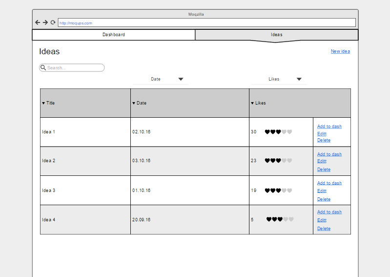
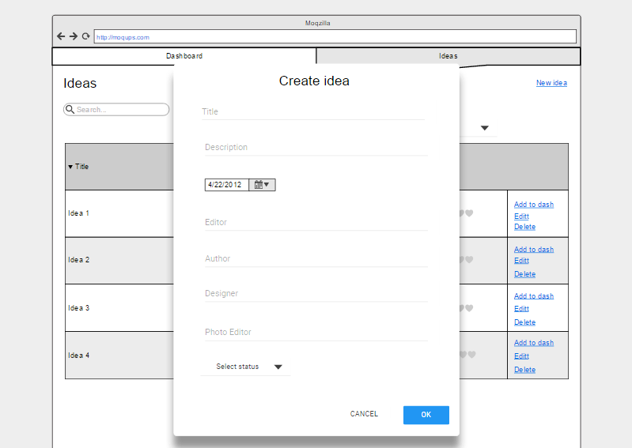
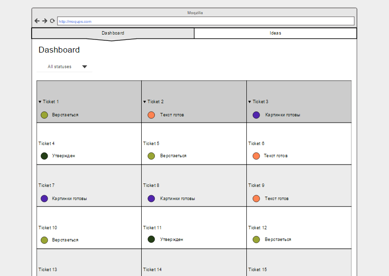
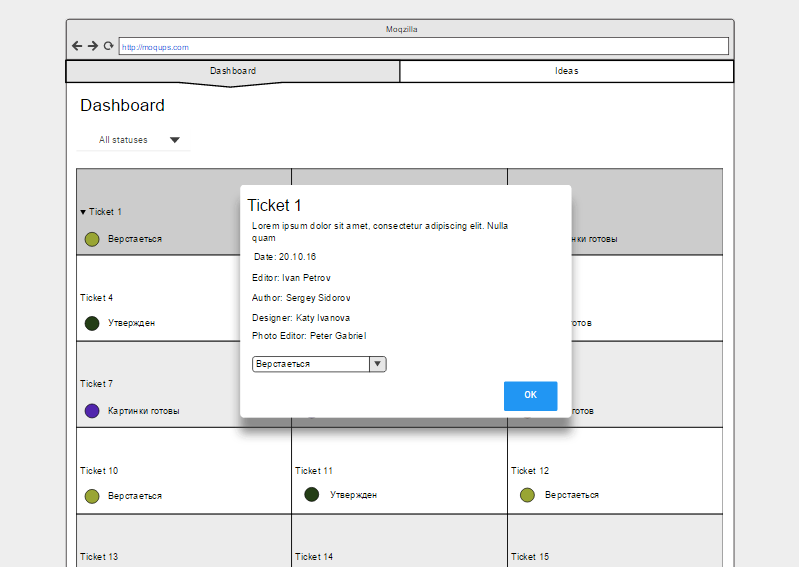

# Setka
## Приложение для управления статьями в редакции.

Суть приложения заключается в создании сервиса, в котором сотрудники редакции журнала могли быстро сохранять новые идею и желаемые темы, и в дальнейшем прослеживать и изменять их состояние. 

Состоит из 2 страниц:

* Ideas - пользователь добавляет желаемые темы для статьи. Они все там же выводятся списком.
* Dashboard - здесь отображаются темы, получившие добро на выпуск.

## Страница Ideas

Здесь собираются все идеи которые приходят сотрудникам в их головы. Они могут быть на самую разную тему. Все идеи отображаются списком.
Выводиться название, дата добавления, лайки и кнопки управления идеей.
Из настроек страницы есть поиск, сортировка по дате и по количеству лайков. Лайки ставятся сотрудниками, если они вдруг наткнулись на идею и она им понравилась.

Идею можно удалить(Delete), отредактировать(Edit) и добавить в Dashboard(Add to Dash). Кнопка Add to Dash превращает идею в тикет.

Для создания новой идеи надо нажать на кнопку New Idea(). Выводиться попап(такой же что и при нажатии на кнопку Edit)

Здесь заполняются поля, выбирается статус идеи и ОК.

## Страница Dashboard

Здесь отображаются идеи получившие состояние Тикет(кнопка Add to dash). Тикеты отображаются в виде ячеек с названием и статусом.
Каждый статус имеет свой цвет: верстается, утвержден, текст готов, картинки готовы. Фильтр помогает выбрать сотруднику именно те тикеты, которые связаны с его сферой. При наведении на тикет появляется попап с более детальной информацией.

